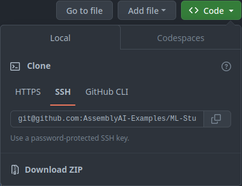

# Basic Concepts

## Repository

`Git` stores your project's entire history and all its branches and commits in a hidden `.git` directory at the root of your project. This directory contains everything `Git` needs to manage your project.

## Working Tree

This is the directory where you interact with your files. It contains the actual project files, and you can modify them, create new ones, or delete them.

## Staging Area (Index)

The staging area is a step between your working tree and the `Git` repository. When you make changes to files in your working tree, `Git` doesn't automatically track them. You need to explicitly tell `Git` which changes you want to include in the next commit by adding them to the staging area using git add.

## Commit

Once you've added changes to the staging area, you can commit them to your `Git` repository using git commit. This creates a new commit with the changes you've staged. Commits are snapshots of your project at a particular point in time, and they become part of your project's history.

## Remote

In `Git`, a "remote" refers to a copy of a `Git` repository that is hosted on a server or another location, separate from your local repository (local meaning on your computer). Remotes are essentially references to the repositories stored on other machines, which can be on your local network or on the internet. Remote repositories are often used for collaboration, backup, and sharing code with others.

By convention, the word "origin" is used to refer to the remote repository, however, it can be called anything at all. It is also possible to have multiple remote repositories linked to your local repository.

<!-- give example with gitlab and github as remotes -->

## What Is Github/Gitlab?

To keep things simple, I'm going to say that these are platforms, were you can store your code, your repositories.

# How to Initialize a Git Repository

```bash
git init
```

# How to Add Files to the Staging Area

## Add Individual Files

```BASH
git add file1.txt file2.txt
```

## Add All Files

### Method 1

```BASH
git add .
```

### Method 2

```BASH
git add -A
```

### Method 3

```BASH
git add --all
```

# How to Commit Changes

Before you can `commit` a change, there must be a change in the staging area. For example, it could be a new file that has been added to the staging area, or it could be a change to a file that is already part of the `Git` repository.

Commit messages are important. Read how to write better commit messages [here](https://www.freecodecamp.org/news/how-to-write-better-git-commit-messages/).

## Method 1

```BASH
git commit -m "Add margin."
```

## Method 2

```BASH
git commit
```

After you type this command, the default terminal editor will open up. You will have to type a commit message, save it, then exit the editor. If you do not save a commit message, no changes will be committed.

# How to Check the Status of Your Working Tree

This will show you if there are any changes in the `Git` repository, and if any new files (untracked files) have been added.

```BASH
git status
```

# How to a Add Remote

<details>
<summary>You can get the link to your repository from your repository's main view.</summary>

</details><br>

```BASH
git remote add origin git@github.com:USERNAME/REPOSITORYNAME.git
```
